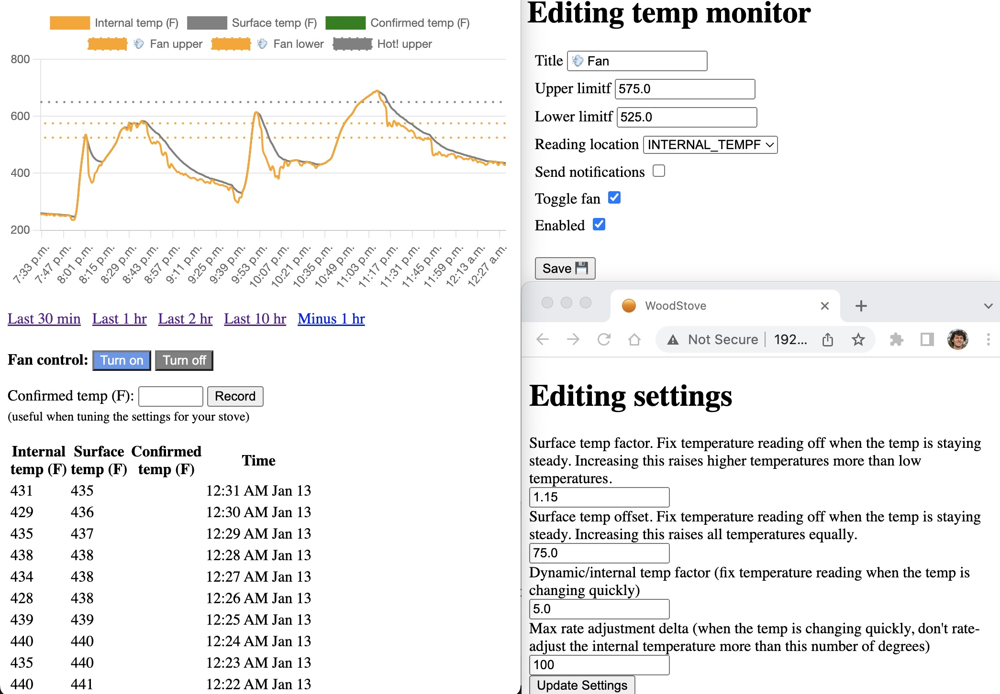

# wood-stove-rails

Features:
- Saves temperature readings every minute
  - cron jobs controlled via https://github.com/javan/whenever
- Web interface for viewing historical temp readings (it's barebones)
- Temperature monitors configurable via web interface
  - Send a push notification via Pushbullet when it's crossed
  - Turn the stove's blower fan off/on when it's crossed (helps **regulate stove temperature**)
- Multiple parameters for tuning temp sensor readings, if they're too high/low
  - Helps accomodate different sensor positions (on top of the stove, pointed at the stove sidewall, further away, etc.)
  - Input field to save confirmed readings, so you can record temperatures from a different thermometer by hand, then tune parameters to make your readings align with them. 
- Auto refresh when new temperature is recorded
- Tab icon changes to reflect the stove's temperature



## Initial setup

Setup rails on your raspberry pi
```
# https://joelc.io/install-ruby-rails-raspberry-pi
# Slow official way

sudo apt-get install screen
screen bash

sudo apt update
sudo apt install -y curl build-essential zlib1g-dev libreadline-dev libssl-dev libxml2-dev
gpg --recv-keys 409B6B1796C275462A1703113804BB82D39DC0E3 7D2BAF1CF37B13E2069D6956105BD0E739499BDB
curl -sSL https://get.rvm.io | bash -s stable --rails

# ctrl+A   D   to disconnect but leave it runnning
# ctrl+D       to kill it
# screen -r # to reconnect
```

Setup redis, if you want the page to automatically refresh to show the latest temperature data (using ActionCable):
```
sudo apt install redis-server
redis-cli ping   # verify it worked
```

Seed some data:
```
bin/rails db:migrate RAILS_ENV=development

# When my temp sensor was pointed at the stove sidewall (where the heat had to go through a lot of 
# material / firebrick), I was using a dynamic_temp_factor of 16.
# Once I moved the temp sensor to point at the top of the stove, I set dynamic_temp_factor to zero with great success.
# However, using some positive value is very helpful along with `ONLY_RATE_ADJUST_DOWN = true` so that your fan turns off quicker if the fire goes out.
Settings.create!(static_temp_factor: 1.15, static_temp_offset: 75, dynamic_temp_factor: 5, max_rate_adjustment_delta: 100)

TempMonitor.create!(upper_limitf: 500, lower_limitf: 60)
```

Set PUSHBULLET_ACCESS_TOKEN env variable, grab one from https://www.pushbullet.com/#settings. Needed for notifications
```
sudo vi /etc/profile
export PUSHBULLET_ACCESS_TOKEN=asdf
:wq

# Test via rails console, TempMonitor.last.send_push_notification!('title here test', 'body')
```

Start the rails server:
```
bundle install
rails s -b 192.168.1.188

# or in the background
screen rails s -b 192.168.1.188
# then ctrl+A   D
```

Or start the rails server automatically on boot:
```
# from
# https://forums.raspberrypi.com/viewtopic.php?p=921354
# https://forums.raspberrypi.com/viewtopic.php?t=202216

cd /etc/systemd/system/
sudo vi woodstove.service

[Service]
WorkingDirectory=/home/pi/wood-stove-rails
ExecStart=/bin/bash -lc 'rails s -b 192.168.1.188'
Restart=always
StandardOutput=syslog
StandardError=syslog
SyslogIdentifier=woodstoverails
User=pi
Group=pi
[Install]
WantedBy=multi-user.target

:wq

sudo chmod u+rwx /etc/systemd/system/woodstove.service
sudo systemctl enable  woodstove # launch it at boot
sudo systemctl start woodstove   # launch it right now
```

Control cron jobs for recording temp info (and processing monitors/notifications):
```
# Turn them on
bundle exec whenever --update-crontab --set environment='development' # see config/schedule.rb

# Turn them off
bundle exec whenever --clear-crontab
```

Start ngrok automatically on boot:
```
cd /etc/systemd/system/
sudo vi ngrok.service

[Service]
WorkingDirectory=/home/pi/
ExecStart=/bin/bash -lc './ngrok http 192.168.1.188:3000 --basic-auth="username_here:password_here"'
Restart=always
StandardOutput=syslog
StandardError=syslog
SyslogIdentifier=ngrok
User=pi
Group=pi
[Install]
WantedBy=multi-user.target

:wq

sudo chmod u+rwx /etc/systemd/system/ngrok.service
sudo systemctl enable  ngrok # launch it at boot
sudo systemctl start ngrok   # launch it right now
```


### Hardware

Enable i2c and friends
```
# Setup i2c. Chapter 7 of freenove manual. https://freenove.com/tutorial.html "Configure I2C and Install Smbus"
sudo raspi-config
# Choose “Interfacing Options” then “P5 I2C” then “Yes” and then “Finish” in this order and restart your RPi.

lsmod | grep i2c # check whether the I2C module is started:

#i2cdetect -y 1
#i2cdump -y 1 0x5a w
pip install smbus
```

Wire up the MLX90614 temp sensor. The sensor has labels "SDA" and "SCL". I happen to have these hooked up to SDA1 and SCL1 (see `port` in lib/read_temp.py). Ground goes to ground, and VIN goes to a 5V output. The raspberry pi pinout diagrams you find on google are from the perspective of looking down on the PI. For understanding the orientation of the extension ribbon cable, imagine it's connecting two PIs side by side on the same surface. If you get this backwards, the sensor will get quite hot.

Other useful links regarding this sensor:
* https://www.amazon.com/gp/product/B071VF2RWM/ref=ppx_yo_dt_b_asin_title_o00_s00?ie=UTF8&psc=1
* https://olegkutkov.me/2017/08/10/mlx90614-raspberry/
* https://www.raspberrypi.org/forums/viewtopic.php?t=17738

Relay board I used: https://www.amazon.com/gp/product/B01G05KLIE/ref=ppx_yo_dt_b_search_asin_title?ie=UTF8&psc=1


## Deploying updates

- Run the test suite on your laptop: `bundle exec rspec`
- SSH into your raspberry pi
- cd into the folder where you've cloned the repo
- `git pull`


## Contributing

This is a side project I'm not investing much time into. Feel free to open an issue and discuss if you really want to contribute something.

